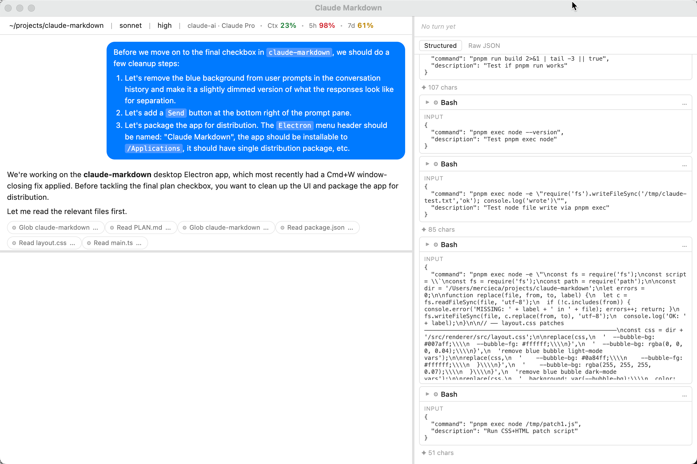

# Claude Markdown

A desktop Electron app that wraps the Claude Code agent loop with a Markdown-rendered prompt and response surface.



---

## Goals

Claude Code is a powerful tool, but the terminal has limits. Three gaps motivate this app:

1. **Prompt rendering** — typed prompts are raw text in the terminal. Claude Markdown renders them as Markdown as you type, using CodeMirror 6 with live decorations (bold, headings, code fences).
2. **Response rendering** — terminal Markdown is limited (no real fonts, no images, no syntax-highlighted tables). Claude Markdown renders responses with full browser-quality Markdown including syntax-highlighted code blocks.
3. **Live visibility** — a right-side pane shows a continuous stream of agent activity (tools used, inputs, outputs), so you can follow along and interrupt if needed.
4. **Ergonomics** — `Enter` inserts a newline; `Cmd+Enter` sends. Session history persists across restarts.

The long-term goal: **a lossless superset of `claude` CLI behavior, with better rendering.** Anything `claude` does headlessly should work here too.

---

## Dependencies

### Runtime

| Package | Purpose |
|:---|:---|
| `electron` | Desktop app host |
| `@anthropic-ai/claude-agent-sdk` | Agent loop, streaming, session management |
| `@codemirror/view`, `state`, `commands`, `language`, `lang-markdown` | Prompt editor with live Markdown decorations |
| `@lezer/highlight` | Token-level styling inside CodeMirror |
| `react`, `react-dom` | Response pane UI |
| `react-markdown` | Markdown rendering in the response pane |
| `rehype-highlight` | Syntax highlighting in rendered code blocks |
| `remark-gfm` | GitHub Flavored Markdown (tables, strikethrough, task lists) |
| `highlight.js` | Highlight.js themes (also applied to CodeMirror color layer) |

### Build / Dev

| Package | Purpose |
|:---|:---|
| `electron-vite` | Vite-based build toolchain for Electron (main + preload + renderer) |
| `electron-builder` | Package into `.app` / `.dmg` for distribution |
| `typescript` | Strict TypeScript across all three processes |
| `eslint`, `typescript-eslint` | Linting |
| `@vitejs/plugin-react` | JSX/TSX compilation in the renderer |

---

## Key Design Points

### Three-process Electron architecture

```
main (Node) ─── IPC ──▶ preload (sandboxed) ──▶ renderer (React)
     │
     └─── @anthropic-ai/claude-agent-sdk (agent loop)
```

- **Main process** runs the SDK agent loop, manages per-window session state, handles all file I/O and OS integration.
- **Preload** is sandboxed (`contextIsolation: true`, `nodeIntegration: false`). It exposes a typed `window.api` object via `contextBridge` — the only bridge between Node and the browser.
- **Renderer** is a pure browser context. All SDK interaction goes through `window.api` IPC calls.

### SDK + CLI hybrid (Option C)

The app uses `@anthropic-ai/claude-agent-sdk` as the primary agent driver. A small allowlist of CLI-only commands (e.g. `/insights`) that the SDK cannot dispatch headlessly are shell-out via `claude --print <command>` and streamed back into the response pane as Markdown.

Slash commands the SDK *can* handle are forwarded as normal prompts. App-owned commands (`/clear`, `/effort`, `/help`) are intercepted client-side.

### Per-window session state

Every window gets a `SessionState` entry keyed by `webContents.id`. This makes multi-window safe by design — there is no global mutable state shared between windows. IPC handlers look up the session by `event.sender.id`.

### Session persistence

On each turn, the SDK's session ID (from the `system/init` message) is captured and written to `~/.claude-markdown/state.json`. On app launch, any saved windows are restored in their prior `cwd` with `resume: sessionId` passed to the SDK. `Cmd+O` opens a session picker listing all sessions for the current `cwd`.

### Layout persistence

Divider positions (left column width, prompt pane height) are saved to `~/.claude-markdown/layout.json` with 500 ms debounce on drag.

---

## Running

```bash
# Install dependencies
pnpm install

# Development (hot-reload)
pnpm dev

# Build distributable
pnpm build
```

To launch from the terminal with the correct working directory:

```bash
# Use the provided shell script so $PWD is passed to the app
./scripts/claude-markdown.sh
```

The shell script sets the working directory to the directory you launch from, which the app uses as the default `cwd` for new sessions.
